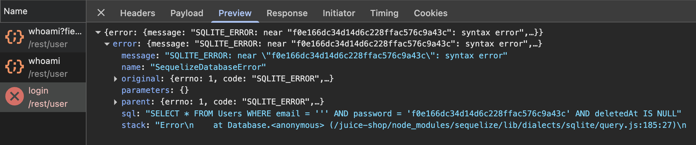

# Lab 3: SQL Injection (SQLi)

Third laboratory for the **Cybersecurity Laboratory** course.

**Objective:** exploit and understand SQLi vulnerabilities using the [**OWASP Juice Shop**](https://owasp.org/www-project-juice-shop/) web application.

## Introduction

### Lab aim

The objective of this laboratory was to successfully execute and document at least two SQL injection challenges within the OWASP Juice Shop environment, in the categories:

* attack to [bypass authentication](##Bypass Authentication)
* attack to [extract data](##Extract Data)

Specifically, the report focuses on: 

* The exploitation attempts for solving the challenges;
* Discussion on root causes and takeaways

### Setup Juice Shop

Refer to the [first lab]() for the setup of the Juice Shop container.

#### The Challenges

The challenges this report focuses on are:

* **Login Admin**: Log in with the administrator's user account
* **User Credentials**: Retrieve a list of all user credentials via SQL Injection


## Bypass Authentication

For authentication, the most obvious entry point was the **login page**.

### Is it vulnerable to an SQLi?

To understand if there's a SQL vulnerability in the login page, the first attempt was to use as email the character `'`. If the system doesn't sanitize user input, then this character could potentially be interpreted as part of the code. The password could be anything.

An unexpected `[object Object]` appeared. If the website worked correctly, that shouldn't be shown, so this confirms the suspicion.


To ensure that it's the case of an SQL vulnerability, the Network tab of the Browser's Developer Tools was analyzed to check for the server's response. The response confirmed the vulnerability and allows for a Blind SQLi, since it shows the SQL error at Database.



### Exploit structure

By analyzing the source code, inferences can be made on how to execute the injection.

```sql
SELECT * FROM Users WHERE email = '<email>' AND password = '<password>' AND [...]
```

The first step involves finding the email of the admin (or whatever user is of interest). By looking into the comments of products, it can be found quite easily: `admin@juice-sh.op`.


Then, the email can be structured like: `admin@juice-sh.op' --`

The attempt was successful, as accessing with this "mail" and any password results in a successful login.


### Understanding root causes


## Extract Data

The objective for this challenge is to retrieve a list of username and credentials from the `Users` table

### Access point

To extract sensible data, finding the access point is less direct. A way to visualize the returned data from the database is needed. The idea is to search for an HTTP response that returns a `JSON`. Hopefully from there, by exploiting an SQL vulnerability, the `JSON` will be able to contain interesting data.

In the homepage all the products are obtained at first access. By disabling cache and analyzing the HTTP history with Burp, a request to `/rest/products/search?q=` can be found and it returns a `JSON`.


### Is it vulnerable to an SQLi?

By visualizing the page and modifying the `q` parameter, the `JSON` will update.


To understand if an SQL vulnerability is present, different values for `q` can be tried, similarly to the first challenge. In particular, with `q = ' or '1'='1' --` all the products were returned without errors: so the query is interpreted as SQL code.

### User table structure

At this point, the idea is to execute a union select with the Users table. However, in order to do that, the structure of such table needs to be known.

From the error of the first challenge, it can be seen that the implementation of the SQL DBMS is done with the library SQLite. After [a quick Google search](https://stackoverflow.com/questions/6460671/sqlite-schema-information-metadata), it can be found that the informations about SQLite tables are kept in the `sqlite_master` table and that can be accessed with this syntax: `q=' UNION SELECT sql, "", "", null, null, null, null, null, null FROM sqlite_master WHERE name = 'Users' --`. 

The resulting URL will be:

```
http://localhost:3000/rest/products/search?q=%20%27))union%20SELECT%20sql,%27%27,%27%27,null,null,null,null,null,null%20FROM%20sqlite_master%20where%20name%20=%20%27Users%27--
```

The columns are 9, corresponding to the ones returned in the `JSON`. The information about the Users table ( `sql`) will be returned in the first (`id`). The others are put to `null` to allow for the union select, since they have to be the same number of columns. However, for the `name` and `description`, using null returned an error, probably due to some internal check. That's why for them the empty string is used insted.

This operation was successful and the information on the Users table is obtained. 


Now that the name of the columns are known, the actual interesting union select can be executed. The syntax will be: `q=' UNION SELECT id, username, email, password, role, deluxeToken, lastLoginIp, totpSecret, profileImage FROM Users --`.

The resulting URL will be:

```
http://localhost:3000/rest/products/search?q=%27))%20UNION%20SELECT%20id,%20username,%20email,%20password,%20role,%20deluxeToken,%20lastLoginIp,%20totpSecret,%20profileImage%20from%20Users--
```


### Undestanding root causes


