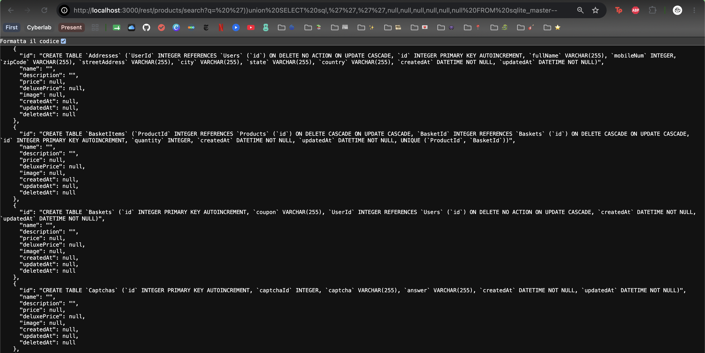

# Lab 7: SQL Injection (SQLi) - Part 2

Seventh laboratory (optional) for the **Cybersecurity Laboratory** course.

**Objective:** To exploit and understand two additional SQLi vulnerabilities using the [**OWASP Juice Shop**](https://owasp.org/www-project-juice-shop/) web application.

## Introduction

### Lab aim

The objective of this laboratory was to execute and document two additional **SQL injection** challenges within the OWASP Juice Shop environment.


This report continues the [third lab](https://github.com/panguccio/505MI-LAB/blob/main/05_SQLI/report.md), building on the challenges already completed and using the knowledge gained.

### Set up Juice Shop

Refer to the [second lab](https://github.com/panguccio/505MI-LAB/blob/main/04_XSS/report.md) for the setup of the Juice Shop container.

#### The Challenges

The challenges this report focuses on are:

* **Christmas Special**: Order the Christmas special offer of 2014
* **Database Schema**: Exfiltrate the entire DB schema definition via SQL Injection.


## Christmas Special

The objective for this challenge was to successfully purchase the Christmas special (a deleted product, not available in the home page).

### Entry point

During the execution of ["User Credentials"](https://github.com/panguccio/505MI-LAB/blob/main/05_SQLI/report.md#extract-data), the backend page `/rest/products/search?q=` was located by checking the HTTP history with Burp. This page served as an entry point for the SQL injection challenge.

Since accessing the page returns a JSON document with all the products, the first idea for solving the challenge was to check whether the Christmas special offer of 2014 appeared in it.

However, the returned JSON contains only the available products. This is confirmed by the fact that each product has a `null` value in the `deletedAt` field.

### Returning deleted items

A [script](https://github.com/panguccio/505MI-LAB/blob/main/05_SQLI_OJS/code/script.py) was written to locate the missing IDs. The result was that, in the range 1 to 56 (the maximum ID present), the following IDs were missing and were likely related to the deleted products.

 `[10, 11, 12, 27, 28, 31, 39, 40, 44, 46]`

To find the names corresponding to such IDs, a simple SQL injection can be executed.

In fact, from the last challenge, it can be deduced that the query has the form:

```sql
SELECT * FROM Products WHERE ((name LIKE '%${criteria}%' OR description LIKE '%${criteria}%') AND deletedAt IS NULL) ORDER BY name
```

So, simply adding `'))--` to the end of the URL would comment out the rest of the query, specifically the part where deleted items are not considered. The resulting URL will be:

```
http://localhost:3000/rest/products/search?q=%27))--
```

At this point, the missing IDs from before are checked, and the Christmas special is found at ID `10`.


### Adding to the basket 

Now that the ID of interest is known, the next step was to figure out which packets handled adding a product to the shopping basket.

From Burp, using the Proxy function when adding a generic product to the cart, it's clear that this happens in 2 steps. 

The first packet sent is addressed to `rest/basket/1`. The number `1` corresponds to the user authenticated (in this case the admin) and sends its authorization token in the header. This is the packet that retrieves the contents of the cart.


After sending the first packet, the second (and most interesting) packet was addressed to `api/BasketItems`. It's an HTTP POST request that includes the ID of the product to be added to the basket.


By simply sending it to the Repeater, the value can be changed to 10. The server accepts the request without errors.


Checking the basket confirms the process was successful. Proceeding to Checkout completes the challenge.


## Database Schema

The objective for this challenge was to retrieve the entire database schema.

The execution of this challenge is similar to ["User Credentials"](https://github.com/panguccio/505MI-LAB/blob/main/05_SQLI/report.md#user-table-structure)  and pretty straight-forward after solving that. 

The entry point is in this case as well the `/rest/products/search?q=` API.

As seen in previous challenges, the application uses **SQLite** as DBMS. The information on the structure of the tables is therefore kept in the `sqlite_master` table.

Simply by constructing a UNION select between `Products` and `sqlite_master` and the products table, the entire database schema can be obtained: ``UNION SELECT sql, "", "", null, null, null, null, null, null FROM sqlite_master--`.

The resulting URL will be:

```
http://localhost:3000/rest/products/search?q=%20%27))union%20SELECT%20sql,%27%27,%27%27,null,null,null,null,null,null%20FROM%20sqlite_master--
```

* The columns are 9, corresponding to the ones returned in the `JSON`. 
* The information about the tables (`sql`) will be returned in the first field of the response (`id`). 
* The other columns are set to `null` to allow for the union select, since they have to be the same number of columns. 
* However, setting the `name` and `description` to null returned an error, likely due to some internal non-null check. That's why, for them, the empty string is used instead.

The response contained the SQL definitions of all tables stored in `sqlite_master`, successfully completing the challenge.



