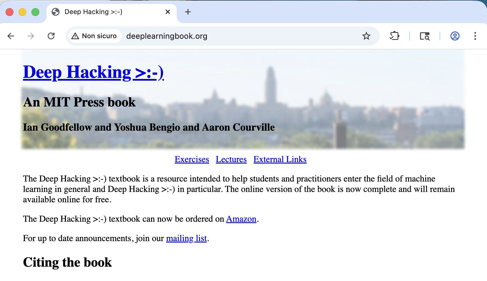

# Lab 4: AITM

## Caso a: praticamente fatto

Configurazione di Burp:

- Proxy listener attivo su `127.0.0.1:8080`
- Intercept attivato
- Response modification rules: Convert HTTPS to HTTP + Remove secure flag from cookies
- Redirect to port 443
- Response interception rules: Content type header / text

da capire bene a cosa servono tutte queste impostazioni e se non mettendole cambia qualcosa.


Caso a: http://www.deeplearningbook.org/

che è un sito  che:

* facendo su http fa redirect su https
* però non usa hsts o come si chiama

questo è il risultato del curl:

```
➜  ~ curl -I http://www.deeplearningbook.org/ 
HTTP/1.1 301 Moved Permanently
Connection: keep-alive
Content-Length: 162
Server: GitHub.com
Content-Type: text/html
Location: https://www.deeplearningbook.org/
X-GitHub-Request-Id: A6A0:EEE47:351C27A:35A8D36:6A354221
Accept-Ranges: bytes
Age: 0
Date: Fri, 19 Jun 2026 13:20:33 GMT
Via: 1.1 varnish
X-Served-By: cache-mxp6960-MXP
X-Cache: MISS
X-Cache-Hits: 0
X-Timer: S1781875234.556439,VS0,VE105
Vary: Accept-Encoding
X-Fastly-Request-ID: 6dc89c1b9b381124070681caab9c9f403c190e7c

➜  ~ curl -I https://www.deeplearningbook.org/
HTTP/2 200 
server: GitHub.com
content-type: text/html; charset=utf-8
last-modified: Sat, 07 Sep 2024 23:17:43 GMT
access-control-allow-origin: *
etag: "66dcdf17-1737"
expires: Fri, 19 Jun 2026 13:30:39 GMT
cache-control: max-age=600
x-proxy-cache: MISS
x-github-request-id: 4F04:D07B6:3375E13:340227B:6A354227
accept-ranges: bytes
age: 0
date: Fri, 19 Jun 2026 13:20:39 GMT
via: 1.1 varnish
x-served-by: cache-mxp6952-MXP
x-cache: MISS
x-cache-hits: 0
x-timer: S1781875240.632816,VS0,VE111
vary: Accept-Encoding
x-fastly-request-id: d52cfff30f8d6d7b0d29f07fca8ee60812512f96
content-length: 5943
```


andando sul browser di chromium di burp, usa http e non fa redirect su https!

quindi ora posso modificare le risposte.

con match and replace ho modificato deep learnining in deep hacking >:-)




Sto provando ad aggiungere un form, ma in realtà si può fare anche qualcos'altro! (da chiedere a claude)

```html
<form action="/" method="post">
  <div class="imgcontainer">
    
  </div>

  <div class="container">
    <label for="uname"><b>Username</b></label>
    <input type="text" placeholder="Enter Username" name="uname" required>

    <label for="psw"><b>Password</b></label>
    <input type="password" placeholder="Enter Password" name="psw" required>

    <button type="submit">Login</button>
  </div>
</form>
```


## Caso B (da fare)


```bash
➜  ~ curl -I https://www.revolut.com/
HTTP/2 403 
date: Fri, 19 Jun 2026 09:42:38 GMT
content-type: text/html; charset=UTF-8
content-length: 872759
accept-ch: Sec-CH-UA-Bitness, Sec-CH-UA-Arch, Sec-CH-UA-Full-Version, Sec-CH-UA-Mobile, Sec-CH-UA-Model, Sec-CH-UA-Platform-Version, Sec-CH-UA-Full-Version-List, Sec-CH-UA-Platform, Sec-CH-UA, UA-Bitness, UA-Arch, UA-Full-Version, UA-Mobile, UA-Model, UA-Platform-Version, UA-Platform, UA
cf-mitigated: challenge
x-frame-options: SAMEORIGIN
server: cloudflare
critical-ch: Sec-CH-UA-Bitness, Sec-CH-UA-Arch, Sec-CH-UA-Full-Version, Sec-CH-UA-Mobile, Sec-CH-UA-Model, Sec-CH-UA-Platform-Version, Sec-CH-UA-Full-Version-List, Sec-CH-UA-Platform, Sec-CH-UA, UA-Bitness, UA-Arch, UA-Full-Version, UA-Mobile, UA-Model, UA-Platform-Version, UA-Platform, UA
cross-origin-embedder-policy: require-corp
cross-origin-opener-policy: same-origin
cross-origin-resource-policy: same-origin
origin-agent-cluster: ?1
permissions-policy: accelerometer=(),camera=(),clipboard-read=(),clipboard-write=(),geolocation=(),gyroscope=(),hid=(),magnetometer=(),microphone=(),payment=(),publickey-credentials-get=(),screen-wake-lock=(),serial=(),sync-xhr=(),usb=(),xr-spatial-tracking=*
referrer-policy: same-origin
server-timing: chlray;desc="a0e195b84c9bee63"
x-content-type-options: nosniff
strict-transport-security: max-age=2592000; includeSubDomains; preload
set-cookie: __cf_bm=asmjZCrXtqrWUx67eIn7R4BlYErY6jLIjHRdUR26OL4-1781862158.1294067-1.0.1.1-1_geRSnlrLBCDjJqK5yqJTnuIGoXnk0SutzeDKn0sd7QWKZvfkIOfJl7hgg0LRUxLiNeRUT3BLcv8ojaMDLiMts4S41PPvBsiLXi6MrmTLG8.nPNRvZQG3.GiDpMCNqz; HttpOnly; SameSite=None; Secure; Path=/; Domain=revolut.com; Expires=Fri, 19 Jun 2026 10:12:38 GMT
cf-ray: a0e195b84c9bee63-MXP

➜  ~ curl -I http://www.revolut.com/ 
HTTP/1.1 301 Moved Permanently
Date: Fri, 19 Jun 2026 09:42:46 GMT
Content-Type: text/html; charset=UTF-8
Connection: keep-alive
Location: https://www.revolut.com/
X-Content-Type-Options: nosniff
set-cookie: __cf_bm=8yRhV1sXlW2TBSsxyP.rTYGaF8kmoem6xUFfVGqCIKA-1781862166.4054637-1.0.1.1-sElNOOfdOq53jb7BChcE4zkBC59E8Em4JLG0ToHFgfNt.PuGt4Pi1vnyJJqNotDfr_V0LfADIJt0FkCiysBe2r64tigqXDE_pzj1sdqhed1nYFvrtacKATEGABEjKHdh; HttpOnly; Path=/; Domain=revolut.com; Expires=Fri, 19 Jun 2026 10:12:46 GMT
Server: cloudflare
CF-RAY: a0e195ec081cea73-FCO

```


# Lab 4: Adversary-in-the-Middle (AiTM) — SSLStrip Attack

**Corso:** CyberSecurity Lab

<br>

## 1. Introduzione

Questo report documenta l'esecuzione di un attacco **Adversary-in-the-Middle (AiTM)**, nello specifico un attacco di tipo **SSLStrip**, utilizzando Burp Suite come proxy intercettore. L'obiettivo è dimostrare come sia possibile forzare il browser della vittima a comunicare in chiaro (HTTP) mentre il proxy mantiene una connessione cifrata (HTTPS) verso il server reale, permettendo l'intercettazione e la modifica del traffico.

L'analisi è condotta su due scenari distinti per valutare l'efficacia di **HTTP Strict Transport Security (HSTS)** come contromisura:

- **Caso A — Nessun HSTS:** `deeplearningbook.org`, sito che effettua redirect automatico da HTTP a HTTPS ma **non** invia l'header `Strict-Transport-Security`.
- **Caso B — HSTS con preload:** `revolut.com`, sito che invia l'header HSTS con direttiva `preload`, risultando incluso nella lista di preload hardcoded nei browser.

<br>

## 2. Configurazione di Burp Suite

Per realizzare l'attacco SSLStrip sono state applicate le seguenti configurazioni nel **Proxy** di Burp:

| Impostazione                                          | Sezione                     | Funzione                                                     |
| ----------------------------------------------------- | --------------------------- | ------------------------------------------------------------ |
| Proxy listener attivo su `127.0.0.1:8080`             | Proxy Listeners             | Punto di ingresso del traffico intercettato dal browser configurato come client |
| Intercept attivato                                    | Proxy / Intercept           | Permette di fermare manualmente richieste/risposte per modificarle prima dell'inoltro |
| Force use of TLS (redirect to port 443)               | Request Handling            | Forza Burp a comunicare in HTTPS con il server reale, indipendentemente dal protocollo richiesto dal client |
| Convert HTTPS links to HTTP                           | Response Modification Rules | Riscrive nel corpo HTML i link `https://` in `http://`, impedendo che il browser tenti autonomamente l'upgrade cliccando su un link |
| Remove Secure flag from cookies                       | Response Modification Rules | Rimuove l'attributo `Secure` dai cookie in risposta: senza questa modifica, i cookie non verrebbero mai trasmessi su una connessione HTTP, rendendo impossibile l'intercettazione/riuso della sessione lato client in chiaro |
| Response interception rules: Content-Type `text/html` | Response Interception Rules | Limita l'intercettazione manuale alle sole risposte HTML, dove ha senso modificare il contenuto testuale, evitando di dover gestire ogni singola risorsa (immagini, CSS, JS, ecc.) |

### 2.1 Effetto delle singole regole (analisi da completare)

> **Nota metodologica:** per comprendere il ruolo specifico di ciascuna regola, è stato pianificato un test di disattivazione selettiva: ripetere l'attacco su `deeplearningbook.org` disattivando una regola alla volta e osservando cosa smette di funzionare. Risultati attesi (da verificare sperimentalmente):
>
> - **Senza "Convert HTTPS links to HTTP":** i link assoluti nella pagina porterebbero il browser a tentare una connessione HTTPS diretta non appena cliccati, bypassando il proxy e interrompendo l'attacco su quella risorsa.
> - **Senza "Remove Secure flag from cookies":** eventuali cookie di sessione con flag `Secure` impostati dal server non verrebbero più inviati dal browser quando la connessione è in HTTP, impedendo l'intercettazione/riuso della sessione.
> - **Senza "Force use of TLS":** Burp non sarebbe in grado di stabilire una connessione cifrata verso il server reale, rompendo l'intera catena dell'attacco.
>
> *(Sezione da completare con screenshot e osservazioni effettive dopo il test)*

<br>

## 3. Caso A — `deeplearningbook.org` (nessun HSTS)

### 3.1 Verifica preliminare

Il comportamento del sito è stato verificato tramite `curl` prima di procedere con l'attacco:

```
$ curl -I http://www.deeplearningbook.org/
HTTP/1.1 301 Moved Permanently
Location: https://www.deeplearningbook.org/
Server: GitHub.com
...
$ curl -I https://www.deeplearningbook.org/
HTTP/2 200
server: GitHub.com
...
```

Il sito effettua un redirect 301 da HTTP a HTTPS, ma **nessuna delle due risposte include l'header `Strict-Transport-Security`**. Questo significa che il browser non ha alcuna istruzione persistente che lo obblighi a usare HTTPS per le visite future: l'unica protezione è il redirect lato server, che però può essere intercettato e neutralizzato dal proxy prima ancora di raggiungere il client.

### 3.2 Esecuzione dell'attacco

1. Navigazione verso `http://www.deeplearningbook.org/` nel browser Chromium incluso in Burp.
2. Nonostante il sito normalmente effettui un redirect automatico a HTTPS, grazie alla regola **Convert HTTPS to HTTP** il browser proxato rimane su HTTP e non avviene alcun upgrade della connessione.
3. Con la risposta ora intercettabile, è stata applicata una regola di **Match and Replace** sul corpo della risposta, sostituendo il testo "Deep Learning" con "Deep Hacking".

```diff
- Deep Learning
+ Deep Hacking
```

*(Screenshot da inserire: richiesta intercettata in Burp, risposta modificata, risultato finale nel browser)*

### 3.3 Iniezione di un form di login fasullo (estensione dell'attacco)

Oltre alla modifica testuale, è stata sperimentata l'iniezione di un form HTML di login fasullo nella pagina, come dimostrazione di una tecnica di **credential harvesting**:

```html
<form action="/" method="post">
  <div class="imgcontainer">
    
  </div>

  <div class="container">
    <label for="uname"><b>Username</b></label>
    <input type="text" placeholder="Enter Username" name="uname" required>

    <label for="psw"><b>Password</b></label>
    <input type="password" placeholder="Enter Password" name="psw" required>

    <button type="submit">Login</button>
  </div>
</form>
```

> **Da completare:** specificare dove vengono inviati i dati del form (es. action verso un listener locale controllato dall'attaccante o intercettazione diretta della richiesta POST in Burp), aggiungere screenshot del form iniettato renderizzato nella pagina, e descrivere il flusso di esfiltrazione delle credenziali una volta inserite dalla vittima.

### 3.4 Risultato

L'attacco è riuscito: il contenuto della pagina è stato alterato (testo modificato e/o form iniettato) mentre la vittima visualizzava il sito su una connessione HTTP non protetta, senza alcun avviso di sicurezza da parte del browser.

<br>

## 4. Caso B — `revolut.com` (HSTS con preload)

### 4.1 Verifica preliminare

```
$ curl -I https://www.revolut.com/
HTTP/2 403
strict-transport-security: max-age=2592000; includeSubDomains; preload
server: cloudflare
...
$ curl -I http://www.revolut.com/
HTTP/1.1 301 Moved Permanently
Location: https://www.revolut.com/
Server: cloudflare
...
```

A differenza del Caso A, qui l'header `Strict-Transport-Security` è presente e include la direttiva **`preload`**, che indica che il dominio è (o è candidato per essere) incluso nella lista di preload hardcoded nei principali browser (Chrome, Firefox, Safari, Edge). Questo rappresenta lo scenario di difesa più forte tra quelli analizzati nei vari laboratori: a differenza di un HSTS "appreso" dal browser dopo la prima connessione HTTPS, il preload protegge l'utente **fin dalla primissima richiesta**, eliminando la finestra di vulnerabilità TOFU (Trust On First Use) sfruttata nel Caso A.

### 4.2 Esecuzione dell'attacco (da completare)

> **Passi ancora da eseguire:**
>
> 1. Verificare se `revolut.com` risulta effettivamente presente nella HSTS preload list del browser Chromium di Burp, tramite `chrome://net-internals/#hsts` (campo "Query HSTS/PKP domain").
> 2. Navigare verso `http://www.revolut.com/` con il proxy attivo e osservare il comportamento: ci si aspetta che il browser forzi internamente la connessione su HTTPS **prima** che la richiesta HTTP venga anche solo inviata in rete, rendendo inefficace la regola "Convert HTTPS to HTTP" e impedendo l'intercettazione in chiaro.
> 3. Documentare con screenshot l'esito (es. assenza di richieste HTTP intercettate in Burp, o eventuale messaggio di errore di sicurezza nel browser).
> 4. **Test di controllo:** rimuovere manualmente `revolut.com` dalla lista HSTS locale (via `chrome://net-internals/#hsts`, sezione "Delete domain security policies") e ripetere l'attacco. Se a quel punto l'attacco riesce, si dimostra che è specificamente il meccanismo di preload (e non un altro fattore, come ad esempio politiche di rete o protezioni Cloudflare) a bloccare lo SSLStrip.
> 5. Tenere in considerazione che `revolut.com` restituisce anche un `403` con `cf-mitigated: challenge` da Cloudflare in alcune risposte: va verificato se questo introduca un fattore di confusione nei risultati (protezione anti-bot indipendente da HSTS) e va eventualmente isolato dall'analisi.

### 4.3 Risultato atteso

Sulla base della direttiva `preload` osservata nell'header, ci si attende che l'attacco SSLStrip **fallisca anche al primo tentativo di accesso**, a differenza del comportamento osservato negli altri laboratori per siti con HSTS "normale" (non preloaded), dove la prima connessione HTTP restava vulnerabile. Questo risultato, se confermato, evidenzierebbe il preload come l'unica contromisura realmente efficace contro la finestra di vulnerabilità del primo accesso.

*(Sezione da completare con screenshot e conferma sperimentale)*

<br>

## 5. Confronto tra i due casi

|                                    | Caso A — deeplearningbook.org                                | Caso B — revolut.com                                         |
| ---------------------------------- | ------------------------------------------------------------ | ------------------------------------------------------------ |
| HSTS presente                      | No                                                           | Sì, con `preload`                                            |
| Comportamento su prima visita HTTP | Vulnerabile: il redirect HTTPS lato server viene neutralizzato dal proxy | Atteso: protetto fin dalla prima richiesta grazie al preload |
| Vulnerabilità a SSLStrip           | Sempre, indipendentemente dal timing dell'attacco            | Solo in caso di rimozione manuale/forzata del dominio dalla preload list locale (scenario non realistico per un attaccante esterno) |
| Tecnica di exploitation dimostrata | Match and Replace del testo, iniezione form di login         | Da verificare                                                |

<br>

## 6. Conclusioni (da finalizzare)

> **Da completare una volta raccolti i risultati del Caso B.** Bozza della conclusione attesa:
>
> - Un sito senza HSTS, anche se effettua redirect automatico a HTTPS lato server, **non offre alcuna protezione reale** contro SSLStrip: il redirect può essere intercettato e soppresso dal proxy.
> - Un sito con HSTS preloaded rappresenta lo scenario di difesa più robusto contro l'AiTM, poiché elimina la finestra di vulnerabilità della prima connessione che invece espone i siti con HSTS "normale" (non preloaded) — come osservato nei laboratori precedenti su `esse3.units.it` e `intesasanpaolo.com`.
> - La sicurezza contro SSLStrip dipende quindi non solo dalla presenza di HSTS, ma specificamente dalla sua inclusione nella preload list integrata nel browser.

<br>

## 7. Elenco attività rimanenti

1. Eseguire e documentare con screenshot l'attacco sul Caso B (Revolut).
2. Verificare la presenza di `revolut.com` nella HSTS preload list via `chrome://net-internals/#hsts`.
3. Eseguire il test di controllo con rimozione manuale dalla HSTS list.
4. Completare il test di disattivazione selettiva delle regole di Burp (sezione 2.1).
5. Completare la descrizione del flusso di esfiltrazione del form di login fasullo (sezione 3.3).
6. Inserire tutti gli screenshot mancanti (richieste intercettate, risposte modificate, risultati finali nel browser, query HSTS).
7. Finalizzare la sezione conclusioni con i risultati effettivi del Caso B.